  

# Sweet Dreams // Engine

Mediatek FPS Unlocker & Thermal Bypass Engine for KernelSU / Magisk. Put the competition to sleep 😴.

**Version:** v1.9.2
**Author:** Lil G Tech Labs

## Features
- CPU / GPU / thermal profile tuning
- FPS unlock engine + display refresh-rate control
- RAM management with adaptive ZRAM and watchdog daemon
- Battery charge limiter with watchdog
- Touch latency / sensitivity tuning
- Network congestion control (BBR) + custom DNS
- Per-game device identity spoofing to unlock FPS tiers gated by device whitelist (not for anti-cheat evasion)
- Game monitor / OOM watcher daemon
- In-app notifications for game launch/exit, thermal override, spoof status
- KernelSU/MMRL WebUI dashboard
- **Auto-update support** — your manager app checks `update.json` against the installed version and notifies you when a new release drops

## Installation
1. Download the latest release zip from [Releases](https://github.com/Just-LilG/Sweet-Dreams-Engine/releases).
2. Flash via KernelSU Manager / MMRL → Modules → Install from storage.
3. Reboot.

## Updating
Once installed, your manager app automatically checks for new versions using `updateJson` in `module.prop`. When a new release is published, you'll get an in-app prompt.

## Changelog
See [CHANGELOG.md](CHANGELOG.md).

## Disclaimer
This module modifies system-level performance and thermal behavior at your own risk. Use on a rooted device with KernelSU. Not affiliated with any game publisher.
